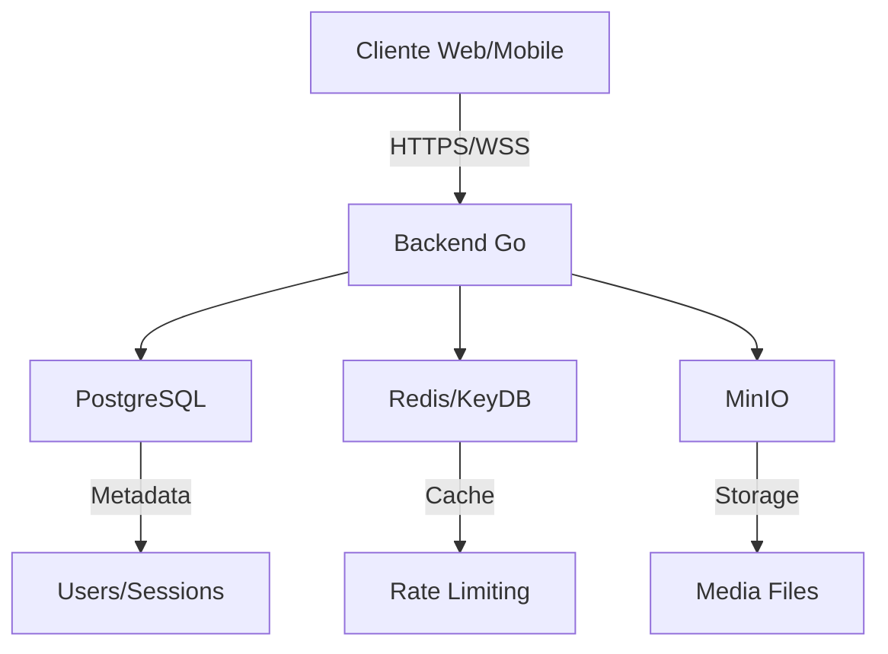

# Chat E2EE - Private Chat Platform

Plataforma de chat privado con encriptación end-to-end, diseñada para máxima privacidad sin almacenamiento de conversaciones.

## 🚀 Quick Start

### Prerequisitos
- Ubuntu Server 22.04+
- Docker & Docker Compose
- Go 1.23+ (para desarrollo)
- 4GB+ RAM
- 20GB+ espacio en disco

### Instalación Rápida

```bash
# 1. Clonar repositorio
git clone <repository-url>
cd chat-e2ee

# 2. Inicializar proyecto
./scripts/init.sh

# 3. Configurar credenciales SMS (opcional)
nano docker/.env

# 4. Iniciar servicios
./scripts/start.sh

# 5. Verificar estado
./scripts/status.sh
```

## 📁 Estructura del Proyecto

```
chat-e2ee/
├── docker/              # Configuración Docker
│   ├── backend/         # Dockerfile del backend
│   ├── postgres/        # Scripts SQL iniciales
│   └── .env             # Variables de entorno
├── src/                 # Código fuente Go
│   ├── cmd/server/      # Punto de entrada
│   └── internal/        # Lógica de negocio
├── scripts/             # Scripts de utilidad
├── data/               # Datos persistentes (git-ignored)
└── logs/               # Logs de servicios (git-ignored)
```

## 🔧 Scripts Disponibles

| Script | Descripción | Uso |
|--------|-------------|-----|
| `init.sh` | Configuración inicial | `./scripts/init.sh` |
| `start.sh` | Iniciar servicios | `./scripts/start.sh` |
| `stop.sh` | Detener servicios | `./scripts/stop.sh` |
| `status.sh` | Ver estado del sistema | `./scripts/status.sh` |
| `logs.sh` | Ver logs | `./scripts/logs.sh [servicio] [-f]` |
| `dev.sh` | Modo desarrollo | `./scripts/dev.sh` |
| `shell.sh` | Acceso a shells | `./scripts/shell.sh [postgres\|redis\|backend]` |
| `backup.sh` | Crear backup | `./scripts/backup.sh` |

Ver [SCRIPTS.md](SCRIPTS.md) para documentación detallada.

## 🏃 Desarrollo

### Modo Desarrollo (Hot Reload)

```bash
# Terminal 1: Servicios base
./scripts/start.sh

# Terminal 2: Backend con hot reload
./scripts/dev.sh

# Terminal 3: Logs
./scripts/logs.sh -f
```

### Acceso a Bases de Datos

```bash
# PostgreSQL
./scripts/shell.sh postgres

# Redis
./scripts/shell.sh redis
```

## 🔌 Servicios y URLs

| Servicio | URL | Puerto |
|----------|-----|--------|
| Backend API | http://localhost:8080 | 8080 |
| PostgreSQL | localhost | 5432 |
| Redis | localhost | 6379 |
| MinIO Console | http://localhost:9001 | 9001 |

## 📡 API Endpoints

- `GET /health` - Estado del servicio
- `GET /api/v1` - Información de la API

### Próximamente
- `/api/v1/auth/*` - Autenticación
- `/ws` - WebSocket para chat
- `/api/v1/users/*` - Gestión de usuarios
- `/api/v1/media/*` - Gestión de archivos

## 🔐 Seguridad

- ✅ E2EE con Signal Protocol
- ✅ Sin almacenamiento de mensajes
- ✅ Autenticación JWT
- ✅ Rate limiting
- ✅ GDPR compliant

## 📊 Arquitectura



## 🆘 Troubleshooting

### Los servicios no inician
```bash
./scripts/status.sh      # Ver diagnóstico
./scripts/logs.sh -f     # Ver logs detallados
```

### Puerto en uso
```bash
# Editar puertos en docker/.env
nano docker/.env
# Cambiar: POSTGRES_PORT=5433, etc.
```

### Reiniciar todo
```bash
./scripts/stop.sh
./scripts/start.sh
```

## 🛠️ Stack Tecnológico

- **Backend**: Go 1.23 + Fiber
- **Base de datos**: PostgreSQL 15
- **Cache**: Redis/KeyDB
- **Storage**: MinIO
- **Containerización**: Docker
- **E2EE**: Signal Protocol (próximamente)

## 📈 Roadmap

- [x] Infraestructura Docker
- [x] Backend básico
- [ ] Autenticación SMS
- [ ] WebSocket relay
- [ ] Signal Protocol integration
- [ ] Frontend PWA
- [ ] Apps móviles

## 🤝 Contribuir

1. Fork el proyecto
2. Crear feature branch (`git checkout -b feature/AmazingFeature`)
3. Commit cambios (`git commit -m 'Add AmazingFeature'`)
4. Push a branch (`git push origin feature/AmazingFeature`)
5. Abrir Pull Request

## 📄 Licencia

Propietaria - Todos los derechos reservados

## 📞 Soporte

Para soporte o consultas, contactar al equipo de desarrollo.

---

**Happy Coding! 🚀**